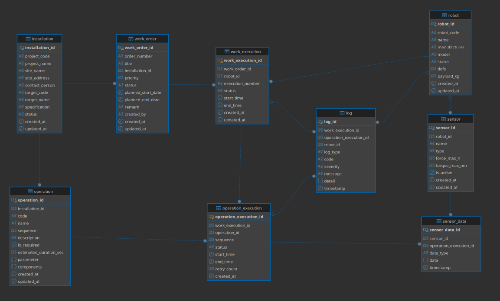

# assembly-cobot

> 두산로보틱스 M0609 협동로봇으로 지상형 태양광 패널 구조물의 조립 공정을 자동화하는 프로젝트

**핵심 공정 순서:** 기둥 설치 → 프레임 설치 → 잠금핀 체결(2단계 삽입) → Frame 좌표계 측정 → 패널 설치

## 1. 시스템 개요

- **F/T 센서 기반 힘 제어 삽입** — Lock Pin 1차 삽입(설정 깊이) 후 재파지/가압으로 최종 삽입, 저항 과다 시 후퇴
- **실측 기반 좌표계 생성** — Frame 기준점(P1/P2/P3) 실측으로 Frame Coordinate System 생성
- **측정 좌표계 기준 후속 동작** — 생성된 Frame Coordinate 기준으로 Panel 위치·자세 제어

```
현장관리자 ↔ Dashboard(HTML/JS) ↔ Flask Backend ↔ PostgreSQL
                                       │ HTTP/REST
                                       ▼
                                  ROS2 Bridge (별도 프로세스)
                                       │ ROS2 Action
                                       ▼
                              Controller ↔ M0609 Robot + Gripper + F/T Sensor
```

자세한 구성도와 각 컴포넌트 간 연결 상태는 `docs/architecture/시스템_구성도_및_작업순서_v2.md`를 참조하세요.

## 2. 운영체제 환경

- **OS:** Ubuntu 24.04
- **ROS Version:** ROS2 Jazzy
- **로봇 프로그래밍:** DART Platform, DART Studio, DRL (Doosan Robot Language, Python 기반)
- **로봇:** Doosan M0609 (그리퍼 + 내장 F/T 센서)
- **Backend:** Python / Flask, SQLAlchemy, PostgreSQL
- **Language:** Python (typing.Protocol / mypy)

## 3. 저장소 구성

이 저장소는 ROS2 colcon 워크스페이스(`src/`)와 Flask 백엔드(`web_app/`)로 구성됩니다. (`web_app/`은 이전 `ws_backend/`를 리네임한 것입니다.)

```
assembly-cobot/
├── src/                      # ROS2 colcon 워크스페이스
│   ├── solar_panel_interface # Action/Msg 인터페이스 정의
│   ├── solar_panel_robot     # 로봇 Controller 노드
│   └── ros2_bridge           # Flask Backend ↔ ROS2 Action HTTP 브릿지
├── web_app/                  # Flask Backend + PostgreSQL 스키마 + 정적 프론트엔드
└── docs/                      # 요구사항 문서 및 아키텍처 문서 (⚠ .gitignore에 등록되어 git에는 커밋되지 않음)
```

### src/solar_panel_interface (ament_cmake)

작업 관리 노드 ↔ Controller 간 통신 인터페이스 (IF-14~16 대응)

- `action/ExecuteOperation.action` — Work Order ID / Operation ID / Parameter 전달, 진행 상태 피드백, 완료/실패 + Error Code 반환
- `msg/Parameter.msg` — Recipe/Operation Parameter (key/value)

### src/solar_panel_robot (ament_python)

| 파일 | 역할 |
|---|---|
| `controller_node.py` | 실제 로봇 Controller 노드 (`namespace="dsr01"`, ExecuteOperation Action Server) |
| `action_server.py` | 실제 장비 없이 통신을 검증하기 위한 Mock Action Server |
| `robot_controller.py` / `robot_motion.py` / `solar_motion.py` | 로봇 모션(Pick/Place 등) |
| `force_control.py` | F/T 센서 기반 힘 제어 삽입 로직 |
| `config_loader.py` | Recipe/Parameter 설정 로딩 |
| `ros_bridge_node.py` | Controller를 직접 호출하는 Action Client (현재 Backend와는 분리되어 있음) |
| `operation_ids.py` | DB Operation ID(1~8) ↔ 이름(`POST_A`...`SOLAR_PANEL_A`) `IntEnum` |
| `config/poses.yaml` | 위치/자세 설정값 |
| `launch/solar_robot.launch.py` | `controller` + `ros_bridge` 노드 실행 |

> `action_server.py`는 아직 `setup.py`의 `console_scripts`에 등록되어 있지 않아 `ros2 run solar_panel_robot action_server`로 바로 실행할 수 없습니다.
> `controller_node.py`는 `ExecuteOperation.action`의 현재 Feedback 스키마(`operation_execution_id`/`status`(uint8 enum)/`message`)로 갱신되지 않은 채 이전 필드(`current_operation`/`status`(문자열)/`progress`)를 그대로 사용하고 있어, 지금 상태로는 Goal을 받는 즉시 Feedback 전송에서 실패합니다.
> `controller_node.py`가 실제로 실행 가능한 Operation 이름(`FRAME_PICK`, `PIN_INSERT_1` 등)은 `operation_ids.py`/DB의 Operation 코드(`postA`, `frameA` 등)와 이름 체계가 다르고 매핑도 비어 있어(`OPERATION_ID_MAP = {}`), DB에서 만든 Operation을 그대로는 실행할 수 없습니다.

### src/ros2_bridge (ament_python)

Flask Backend의 HTTP 요청을 큐에 쌓았다가 ROS2 Action Goal로 변환해 Controller에 전달하는 브릿지 노드입니다. 노드 자체에 Flask HTTP 서버(포트 8001)를 내장합니다.

- `POST /jobs` — Work Order 하나의 Operation 전체(`operations` 배열)를 한 번에 받아 sequence 순서대로 큐에 쌓고, 하나씩 Action Goal로 전송
- `GET /health`, `GET /status` — Backend가 호출하는 상태 조회 API
- Action Feedback을 받을 때마다 Backend의 `POST /api/v1/executions/action-feedback`으로, 완료/실패 시 `POST /api/v1/executions/action-result`로 콜백
- Operation 하나가 실패하면 같은 Work Execution의 나머지 대기 중인 Operation은 큐에서 건너뜀

### web_app (Flask Backend)

| 위치 | 역할 |
|---|---|
| `app/routes`, `app/services`, `app/models` | Work Order / Operation / 실행 이력(Work Execution, Operation Execution) / Robot / Installation API |
| `app/routes/work_orders.py` | `POST /<id>/execute` — Operation 전체를 한 번에 Bridge에 제출, `GET /<id>/progress` — 진행률 조회 |
| `app/routes/executions.py` | `POST /action-feedback`, `POST /action-result` — Bridge 콜백 수신, DB 상태 갱신 |
| `database/schema.sql` | PostgreSQL 스키마 (9개 테이블) |
| `frontend/` | 정적 HTML/CSS/JS 대시보드 |

## 4. DB 구조


## 5. 의존성

- ROS2 Jazzy (`rclpy`)
- Python 3 (`setuptools`, `pytest` for test)
- Flask, Flask-SQLAlchemy, SQLAlchemy, python-dotenv, psycopg2, requests (`web_app/requirements.txt`)
- PostgreSQL 16 (로컬 설치)

## 6. 빌드 및 실행

전체 구성 요소(DB → Backend/Frontend → ROS2 Bridge/Controller → M0609 Virtual + rviz2)를 처음부터 띄우는 순서입니다. 터미널을 여러 개 열어 각 단계를 순서대로 실행하세요.

### 6.1 PostgreSQL (DB)

```bash
cd web_app
cp .env.example .env             # DB_USER/DB_PASSWORD 등 접속정보를 채운다

./database/setup_db.sh --seed    # 스키마 생성 + 데모 시드 데이터 적용
```

`web_app/database/README.md`에 계정/권한(`grant.sql`) 및 초기화(`reset_db.sh`) 절차가 별도로 정리되어 있습니다.

### 6.2 Flask Backend + Frontend

Backend가 정적 프론트엔드도 같이 서빙하므로 별도 Frontend 서버는 필요 없습니다.

```bash
cd web_app
python3 -m venv .venv
.venv/bin/python -m pip install -r requirements.txt

source .venv/bin/activate
python run.py                    # http://localhost:5000 (API + Dashboard)
```

브라우저에서 `http://localhost:5000`에 접속하면 Work Order 대시보드가 보입니다. 상세 검증 절차는 `web_app/app/README.md`, `web_app/frontend/README.md`를 참조하세요.

### 6.3 ROS2 워크스페이스 빌드

```bash
source /opt/ros/jazzy/setup.bash
colcon build --symlink-install
source install/setup.bash
```

### 6.4 M0609 Virtual 로봇 + rviz2

Doosan이 제공하는 ROS2 패키지(`dsr_bringup2` 등, 이 저장소에는 포함되어 있지 않고 별도 설치가 필요합니다)로 가상 로봇을 띄웁니다. `namespace`/`model`은 `controller_node.py`의 `ROBOT_ID = "dsr01"`, `ROBOT_MODEL = "m0609"`와 반드시 일치해야 합니다.

```bash
source /opt/ros/jazzy/setup.bash
source ~/ws_cobot_pjt/ws_dsr/install/setup.bash   # Doosan Robotics 패키지 워크스페이스

ros2 launch m0609_rg2_bringup bringup.launch.py \
    mode:=virtual \
    name:=dsr01 \
    model:=m0609 \
    host:=127.0.0.1 \
    port:=12345
```

가상 로봇과 함께 rviz2가 자동으로 뜨지 않으면 별도 터미널에서 실행합니다.

```bash
rviz2
```

### 6.5 이 프로젝트의 Controller + Bridge

가상 로봇이 떠 있는 상태에서 이 저장소의 `solar_panel_robot`/`ros2_bridge` 노드를 실행합니다.

```bash
ros2 launch solar_panel_robot solar_robot.launch.py \
    robot_id:=1 \
    backend_base_url:=http://127.0.0.1:5000
```

`controller` Action Server(`/dsr01/execute_operation`)와 `ros2_bridge`(Flask HTTP 서버, 포트 8001)가 함께 실행됩니다. `robot_id`는 6.2에서 접속한 DB의 `robot.robot_id`와 일치해야 합니다.

### 6.6 로봇 조종 (Dashboard → rviz2)

1. `http://localhost:5000` 대시보드에서 Work Order를 생성하고 `READY` 상태로 전환합니다.
2. `robot_id`를 지정해 실행(`POST /<id>/execute`)하면 Backend → Bridge → Controller 순서로 Action Goal이 전달되고, 가상 로봇이 움직이는 모습을 rviz2에서 확인할 수 있습니다.
3. 진행 상태는 대시보드의 `/<id>/progress` 조회 또는 각 터미널의 ROS2 로그(`[STATUS]`, `[IF-15]` 등)로 확인합니다.

> ⚠️ **현재 알려진 제약**: `controller_node.py`가 `ExecuteOperation.action`의 최신 Feedback 스키마와 Operation 이름 체계에 맞춰져 있지 않아, 위 순서대로 실행해도 Goal 전달 이후 단계에서 실패할 수 있습니다 (§3 `src/solar_panel_robot` 하단 각주 참조). 통신 흐름만 먼저 검증하려면 6.5의 `controller` 대신 Mock Server를 띄우세요.
>
> ```bash
> ros2 run solar_panel_robot action_server
> ```

## 7. 문서

상세 요구사항은 `docs/` 디렉토리를 참조하세요 (BR → SYS-FR → FR → TC 추적 체계).

| 문서 | 내용 |
|---|---|
| `docs/01_비즈니스_요구서.md` | 비즈니스 목표(BR), 범위, Actor 구분 |
| `docs/02_시스템_요구서.md` | 시스템 기능/비기능 요구사항(SYS-FR/NFR) |
| `docs/03_기능_요구서.md` | 기능 요구서(FR) Traceability Matrix, 잠금핀 체결 상세 |
| `docs/04_인터페이스_요구사항.md` | 물리/ROS2/DB 인터페이스 계약 |
| `docs/05_테스트_요구사항.md` | 테스트 케이스(TC), 요구사항 추적표 |
| `docs/06_하드웨어_요구사항.md` | 하드웨어 구성, Lock Pin/Bracket/좌표계 측정 구조 설계 |
| `docs/07_db_요구사항.md` | DB 데이터 항목 |
| `docs/08_ops_요구사항.md` | 운영 절차 |
| `docs/09_maint_요구사항.md` | 유지보수 점검 항목 |
| `docs/architecture/시스템_구성도_및_작업순서_v2.md` | 실제 구현 기준 시스템 구성도 (최신) |
| `docs/architecture/시스템_구성도_및_작업순서.md` | 초기 구상 초안 (참고용, 실제 구현과 다름) |

> `docs/`는 `.gitignore`에 등록되어 있어 로컬에만 존재합니다. `ws_backend/docs/TIL.md`(Step별 구현 기록)는 `ws_backend/` → `web_app/` 리네임 과정에서 사라졌습니다.
