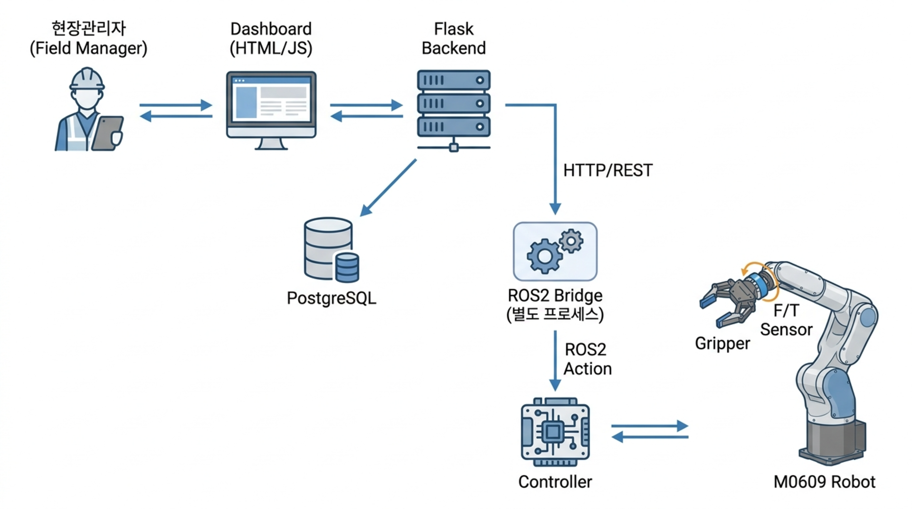

# Assembly-Cobot: Collaborative Robot-Based Solar Panel Installation Automation System
<p align="center">
  
  
  
</p>

  
## 1. 시스템 개요
<p align="center">
  
</p>

본 로봇은 현장 관리자가 대시보드를 통해 내린 명령을 수행하며, **기둥 설치 → 프레임 설치 → 잠금핀(Snapfit) 체결 → 패널 설치**의 공정 순서를 갖는다.  
로봇 제어의 주요 기술은 F/T 센서 기반 힘 제어와 periodic 동작 기반 끼워맞춤, move_arc 함수를 통한 유연한 경로 생성이다.
  
**1. F/T 센서 기반 힘 제어:** Post 1차 삽입 후 2차 가압으로 최종 삽입. 1차 삽입 실패 시 25개 좌표(단위: 0.3mm)를 기준으로 최적점을 찾아 2차 삽입 진행  
**2. Periodic 끼워맞춤:** 프레임과 기둥 끼워맞춤을 위해 xy축 방향으로 진동 발생  
**3. move_arc 경로 생성:** 2차함수 기반 경로를 생성하여 낮은 자재 위치와 높은 설치 위치 간 접촉없이 이동 가능하도록 설계
  
  
## 2. 운영체제 환경

- **OS:** Ubuntu 24.04
- **ROS Version:** ROS2 Jazzy
- **로봇 프로그래밍:** DART Platform, DART Studio, DRL (Doosan Robot Language, Python 기반)
- **로봇:** Doosan M0609 (그리퍼 + 내장 F/T 센서)
- **Backend:** Python / Flask, SQLAlchemy, PostgreSQL
- **Language:** Python  
  
## 3. 저장소 구성

ROS2 colcon 워크스페이스(`src/`)와 Flask 백엔드(`web_app/`)로 구성되며, 세부 항목은 아래와 같다.

```
assembly-cobot/
├── src/                      # ROS2 colcon 워크스페이스
│   ├── solar_panel_interface # Action/Service/Msg 인터페이스 정의
│   ├── solar_panel_robot     # 로봇 Controller 노드
│   └── ros2_bridge           # Flask Backend ↔ ROS2 Action HTTP 브릿지
├── web_app/                  # Flask Backend + PostgreSQL 스키마 + 정적 프론트엔드
└── docs/                      # 요구사항 문서 및 아키텍처 문서 
```

### src/solar_panel_interface (ament_cmake)

작업 관리 노드 ↔ Controller 간 통신 인터페이스 (IF-14~16 대응)

- `action/ExecuteOperation.action` — Work Order ID / Operation ID / Parameter 전달, 진행 상태 피드백(STATUS_PENDING~CANCELLED), 완료/실패 + Error Code 반환
- `msg/Parameter.msg` — Recipe/Operation Parameter (key/value)
- `msg/SystemEvent.msg` — Controller → Bridge 이벤트/오류 알림 (severity·code·phase·status·detail)
- `srv/StopOperation.srv` — 실행 중인 Operation 강제 정지 요청
- `srv/RecoverRobot.srv` — ERROR 상태 로봇 복구 요청

### src/solar_panel_robot (ament_python)

| 파일 | 역할 |
|---|---|
| `controller_node.py` | 실제 로봇 Controller 노드 (`namespace="dsr01"`이지만 Action은 절대 경로 `/execute_operation`으로 등록, ExecuteOperation Action Server) |
| `action_server.py` | 실제 장비 없이 통신을 검증하기 위한 Mock Action Server. `ExecuteOperation` Action 외에 `StopOperation`/`RecoverRobot` Service도 함께 구현 |
| `robot_controller.py` | 로봇 초기 세팅 함수 |
| `robot_motion.py` | 기본적인 로봇 모션(Pick&Place) |
| `solar_motion.py` | 작업 단위 로봇 모션(Post, Panel, Frame 등) |
| `force_control.py` | F/T 센서 기반 힘 제어 삽입 로직 |
| `launch/solar_robot.launch.py` | `controller` & `ROS bridge` 노드 실행 |

### src/ros2_bridge (ament_python)

Flask Backend의 HTTP 요청을 큐에 쌓았다가 ROS2 Action Goal/Service 호출로 변환해 Controller에 전달하는 브릿지 노드입니다. 노드 자체에 Flask HTTP 서버(포트 8001)를 내장합니다.

- `POST /jobs` — Work Order 하나의 Operation 전체(`operations` 배열)를 한 번에 받아 sequence 순서대로 큐에 쌓고, 하나씩 Action Goal로 전송
- `POST /works/<id>/stop` — 실행 중인 Work를 `StopOperation` Service로 중지 요청
- `POST /robots/<id>/recover` — ERROR 상태 로봇을 `RecoverRobot` Service로 복구 요청
- `GET /health`, `GET /status` — Backend가 호출하는 상태 조회 API
- Action Feedback을 받을 때마다 Backend의 `POST /api/v1/executions/action-feedback`으로, 완료/실패 시 `POST /api/v1/executions/action-result`로 콜백
- Controller가 publish하는 `/system_event`를 구독해 Backend의 `POST /api/v1/logs`로 전달
- Operation 하나가 실패하면 같은 Work Execution의 나머지 대기 중인 Operation은 큐에서 건너뜀

### web_app (Flask Backend)

프론트엔드·백엔드·DB는 완성 단계로, Work Order/Robot/Dashboard/Log 전 구간이 연동되어 있습니다.

| 위치 | 역할 |
|---|---|
| `app/routes`, `app/services`, `app/models` | Work Order / Operation / 실행 이력(Work Execution, Operation Execution) / Robot / Installation API |
| `app/routes/work_orders.py` | `POST /<id>/execute` — Operation 전체를 한 번에 Bridge에 제출, `GET /<id>/progress` — 진행률 조회, `POST /<id>/stop` — 강제 정지 |
| `app/routes/executions.py` | `POST /action-feedback`, `POST /action-result` — Bridge 콜백 수신, DB 상태 갱신 |
| `app/routes/robots.py` | `GET /` — 로봇 목록 + 현재 실행 중인 Work 정보, `POST /<id>/recover` — ERROR 로봇 복구 |
| `app/routes/dashboard.py` | `GET /` — 대시보드 집계(로봇별 활성 실행, 성공률 등) |
| `app/routes/logs.py` | 시스템 로그 조회/기록 (`/system_event` → Bridge → 여기로 연결됨) |
| `database/schema.sql` | PostgreSQL 스키마 (9개 테이블) |
| `frontend/` | 정적 HTML/CSS/JS 대시보드 — Work Order 생성/조회/실행/강제정지, 로봇 상태/복구, 시스템 로그 UI |

## 4. DB 구조
<p align="center">
  
</p>

## 5. 의존성

- ROS2 Jazzy (`rclpy`)
- Python 3 (`setuptools`, `pytest` for test)
- Flask, Flask-SQLAlchemy, SQLAlchemy, python-dotenv, psycopg2, requests (`web_app/requirements.txt`)
- PostgreSQL 16 (로컬 설치)

## 6. 빌드 및 실행

전체 구성 요소(DB → Backend/Frontend → ROS2 Bridge/Controller → M0609 Virtual + rviz2) 실행 단계  

### 6.1 PostgreSQL (DB)
```bash
cd web_app
cp .env.example .env             # DB_USER/DB_PASSWORD 등 접속정보를 채운다

./database/setup_db.sh --seed    # 스키마 생성 + 데모 시드 데이터 적용
```
세부사항: `web_app/database/README.md` 참조  

### 6.2 Flask Backend + Frontend
```bash
cd web_app
python3 -m venv .venv
.venv/bin/python -m pip install -r requirements.txt

source .venv/bin/activate
python run.py                    # http://localhost:5000 (API + Dashboard)
```
세부사항: `web_app/app/README.md`, `web_app/frontend/README.md` 참조  

### 6.3 ROS2 워크스페이스 빌드
```bash
source /opt/ros/jazzy/setup.bash
colcon build --symlink-install
source install/setup.bash
```
  
### 6.4 M0609 Virtual 로봇 + rviz2
※ Doosan에서 제공하는 ROS2 package는 해당 저장소에 포함되지 않음
```bash
source /opt/ros/jazzy/setup.bash
source ~/ws_cobot_pjt/ws_dsr/install/setup.bash   # Doosan Robotics 패키지 워크스페이스

ros2 launch m0609_rg2_bringup bringup.launch.py \
    mode:=virtual \
    name:=dsr01 \
    model:=m0609 \
    host:=127.0.0.1 \
    port:=12345
```
  
### 6.5 이 프로젝트의 Controller + Bridge
```bash
ros2 launch solar_panel_robot solar_robot.launch.py \
    robot_id:=1 \
    backend_base_url:=http://127.0.0.1:5000
```
  
### 6.6 로봇 조종 (Dashboard → rviz2)

1. `http://localhost:5000` 대시보드에서 Work Order 생성 후 `READY` 상태로 전환
2. `robot_id` 지정 후 실행하여 rivz2에서 로봇 동작 확인 (Action Goal 전달 루트: Backend → Bridge → Controller)
3. 대시보드의 `/<id>/progress` 조회 또는 각 터미널의 ROS2 로그(`[STATUS]`, `[IF-15]` 등)를 통한 진행 사항 확인


## 7. 문서
상세 요구사항은 `docs/` 디렉토리 참고 (BR 6 → SYS-FR 24 → FR 24 → TC 15 추적 체계).  

| 문서 | 내용 |
|---|---|
| `docs/01_비즈니스_요구서.md` | 비즈니스 목표(BR), 범위, Actor 구분 |
| `docs/02_시스템_요구서.md` | 시스템 기능/비기능 요구사항(SYS-FR/NFR) |
| `docs/03_기능_요구서.md` | 기능 요구서(FR) Traceability Matrix, 잠금핀 체결 상세 |
| `docs/04_인터페이스_요구사항.md` | 물리/ROS2/DB 인터페이스 계약 |
| `docs/05_테스트_요구사항.md` | 테스트 케이스(TC), 요구사항 추적표 |
| `docs/06_하드웨어_요구사항.md` | 하드웨어 구성, Lock Pin/Bracket/좌표계 측정 구조 설계 |
| `docs/07_db_요구사항.md` | DB 데이터 항목 |
| `docs/08_ops_요구사항.md` | 운영 절차 |
| `docs/09_maint_요구사항.md` | 유지보수 점검 항목 |
| `docs/10_최종_시스템_시나리오.md` | 전체 조립 시나리오 (단계별) |
| `docs/소스코드_역할_정리.md` | 소스 파일별 역할 요약 |  

아키텍처/발표 문서 (`docs/architecture/`):  

| 문서 | 내용 | 저장소 |
|---|---|---|
| `시스템_구성도_및_작업순서_v2.md` | 실제 구현 기준 시스템 구성도 (최신) | 포함 |
| `시스템_구성도_및_작업순서.md` | 초기 구상 초안 (참고용, 실제 구현과 다름) | 포함 |
| `파일별_함수_동작순서.md` | 프로세스 기동 순서 + 작업 지시 1건의 함수 단위 흐름 | 로컬 전용 |
| `DB_데이터_흐름.md` | 9개 테이블별 데이터 유입·유출 경로 | 로컬 전용 |
| `기술_발표_스크립트.md` | 발표자료 PDF(01~05) 순서에 맞춘 발표 대본 | 로컬 전용 |

